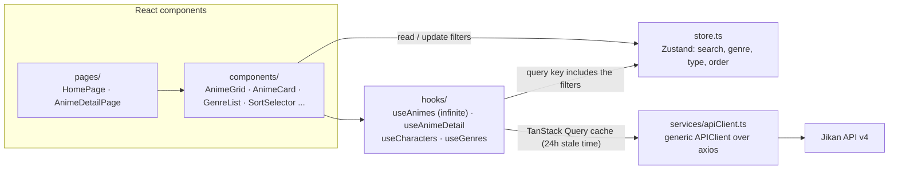

# AnimeVerse

[](https://github.com/GabeMed/my-anime-list-clone/actions/workflows/ci.yml)

A MyAnimeList-style anime browser built with React 18 and TypeScript. It reads
data from the public [Jikan API](https://jikan.moe) (an unofficial
MyAnimeList API). I built it to sharpen my frontend skills.

**Live:** https://animeverse-theta.vercel.app

## Features

- Infinite-scrolling grid of anime cards with MAL score, media type and genres; loading skeletons.
- Filters: genre (sidebar), media type (TV, Movie, OVA, ...), sort order (name, release date, popularity, score) and text search. The filters combine and live in a small Zustand store.
- Detail page with an expandable synopsis, producers, studios, genres, streaming services, the YouTube trailer (with an easter egg when there is none) and the main characters with their voice actors.
- Light and dark themes built from Chakra UI v3 semantic tokens, with a custom gray palette and breakpoints; responsive from phone to wide screens.

## Architecture



- **Server state** is handled by TanStack Query. `useAnimes` is an infinite query whose key contains the current filters, so changing a filter starts a new paginated list. Genres ship as static data (`data/genres.ts`) and are used as `initialData`, so the sidebar renders without a request.
- **Client state** (the filters) lives in a Zustand store. Components subscribe with selectors so they re-render only for the field they use.
- **API access** goes through one generic `APIClient<T>` (`getAll`, `get`) that is typed with the entity interfaces in `entities/`.

```text
Frontend/src/
├── components/   UI and domain components (ui/ holds the Chakra UI snippets)
├── data/         static genre list
├── entities/     TypeScript models of the Jikan responses
├── hooks/        TanStack Query hooks
├── pages/        routes: home, detail, error
├── services/     axios client
├── utils/        media-type icons/colors, synopsis cleanup
├── routes.tsx    React Router 7 routes
├── store.ts      Zustand store
└── theme.ts      Chakra UI tokens and semantic colors
```

## Run locally

Requires Node 22 (or 20.19+). The Jikan API needs no key.

```bash
cd Frontend
npm ci
npm run dev        # http://localhost:5173
```

## Tests and checks

```bash
cd Frontend
npm run typecheck  # tsc
npm run lint       # ESLint + typescript-eslint + rules of hooks
npm test           # Vitest + Testing Library (jsdom)
npm run build      # tsc && vite build
```

The 18 tests don't touch the network. They cover:

- **Components:** the anime card (content, link and unknown-type fallback), the grid (cards, and showing an API error without crashing), the genre list (select and clear), the expandable synopsis and the score badge.
- **Logic:** the filter store, the mapping from filters to Jikan query parameters, and the synopsis cleanup.

[CI](.github/workflows/ci.yml) runs all four commands on every push and pull
request. The site deploys to Vercel from `main`; `Frontend/vercel.json`
rewrites client-side routes such as `/anime/1` to `index.html`.

## Tech stack

React 18, TypeScript, Vite, Chakra UI v3 (with `next-themes`), TanStack Query
v4, Zustand, React Router 7, axios, react-infinite-scroll-component,
react-youtube, framer-motion. Tooling: ESLint, Vitest, Testing Library.

## History

The project was built in two phases:

1. [Part 1](https://github.com/GabeMed/my-anime-list-clone/tree/3d1c7cb23df876b9300d67e8ebc339e8a06739f2): layout, genre/type/search filtering, theming and responsiveness.
2. Part 2: detail pages with routing, sort order, trailers and characters, Zustand selectors, and deployment to Vercel.

## Credits

Inspired by [CodeWithMosh's Game Hub](https://github.com/mosh-hamedani/game-hub),
a clone of [RAWG](https://rawg.io/), adapted here to anime with its own UI and
detail pages. Data from [Jikan](https://jikan.moe) / MyAnimeList.
